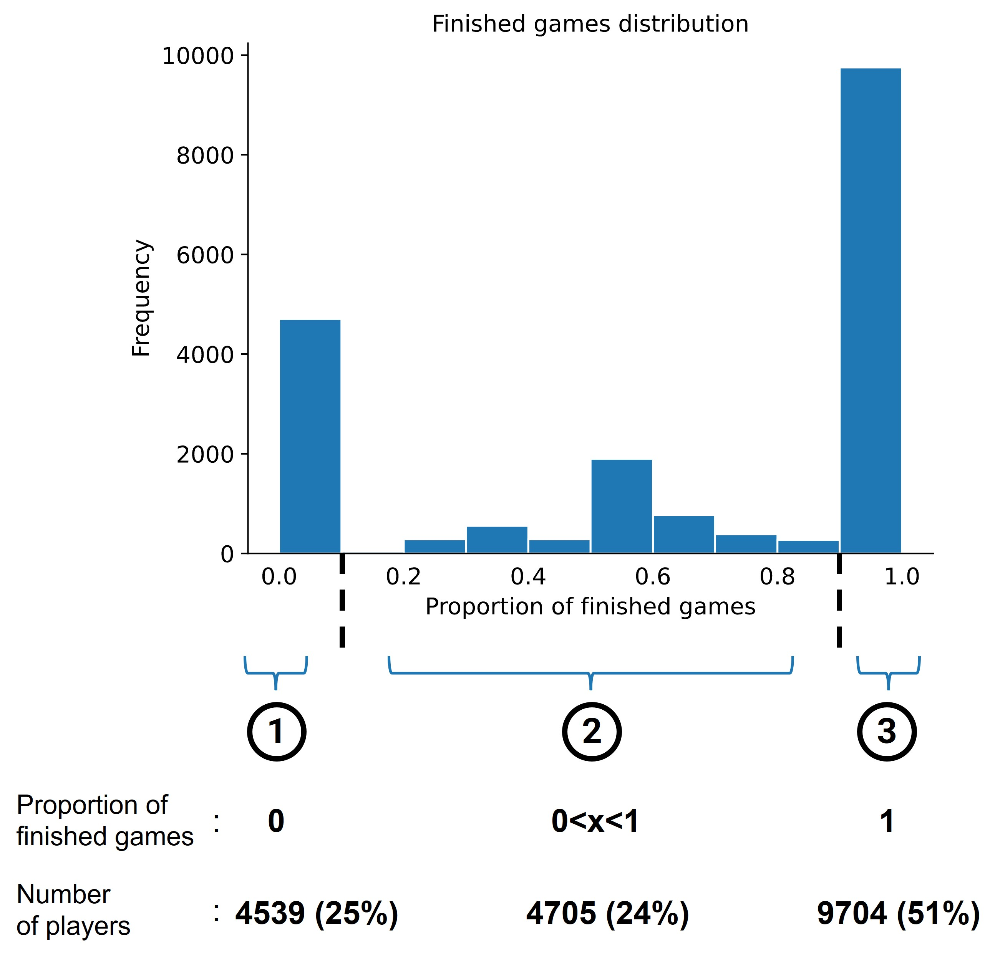
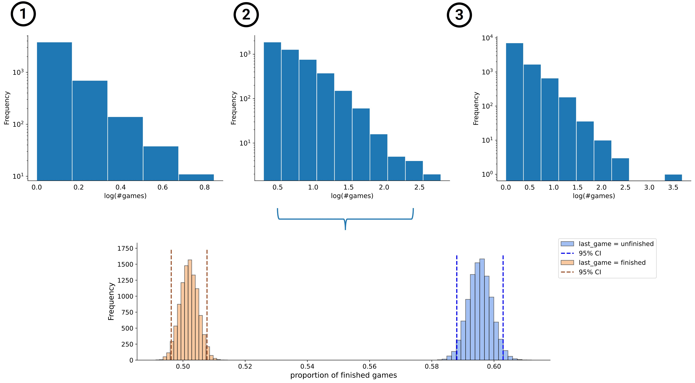

       <h2 style="color:white">Interlude</h2>

    
        Wikispeedia is an online human-computation game based on Wikipedia <a href="https://dlab.epfl.ch/wikispeedia/play/">[1]</a>. A player has to navigate from a designated source to a given target article, solely by clicking on Wikipedia links. As such, this generates a dataset that contains human navigation paths on Wikipedia which allows for interesting studies. That is, topics concerning the semantic distance between concepts <a href="http://infolab.stanford.edu/~west1/pubs/West-Pineau-Precup_IJCAI-09.pdf">[2]</a> or the searching behavior of humans <a href="http://infolab.stanford.edu/~west1/pubs/West-Leskovec_WWW-12.pdf">[3]</a> can be interrogated. To do this, a lot of data is needed which can be supported by an active community that frequently plays the Wikispeedia game.  But how can you get people to play and finish the game maybe even multiple times? What motivates people to finish the task and do not give up? With this work these questions are answered by proposing a set-up for the game that is likely to incentivize people to stay engaged, and hence more data for analysis purposes can be generated.
    

 

     

    <i ><b>Table 1</b></i>

 

       <h2 style="color:white">Data</h2>

    
        In this study a condensed version of Wikipedia is used <a href="https://snap.stanford.edu/data/wikispeedia.html">[4]</a>. Summary statistics can be found in <i><b>Table 1</b></i> above. We are interested in the individual players and more particularly in their unfinished paths. As we would like to motivate players to succesfully complete multiple games, we in the first place have to understand why some players are actually not able to finish a game.   
        For each unique player we can compute the proportion of finished games over the total number of games played by that person. The distribution of the latter is displayed in <i><b>Figure 1</b></i> below.
    

 

     

    <i ><b>Figure 1</b></i>

 

    
        Based on this result we can partition the players into 3 groups:   
        <ul>
            <li><b>1.</b> Players with <b>0</b> finished games. </li>
            <li><b>2.</b> Players with <b>partially</b> finished games. </li>
            <li><b>3.</b> Players with <b>only</b> finished games. </li>
        </ul>  
        Hence we observe that a substantial <b>25%</b> of the total number of players do not have any finished game at all&#128533; This is a big loss<b>!</b> Imagine if this portion would also have had succesful attemps (i.e. finished games). Then there would have been much more data on finished games to do further analysis on. On the other side of the spectrum we find that <b>51%</b> of the players have finished games only. We want to investigate what caused this bifurcation of behavior. The remaining <b>24%</b> falls in between these two categories. These players experience mixed results when playing the Wikispeedia game.   
        Let's have a look at the number of games played per group displayed in the <i><b>Figure 2</b></i> below.
    

 

     

    <i ><b>Figure 2</b></i>

    
        First we see that the distribution of the number of games played for all groups (i.e. <b>1.</b>, <b>2.</b> and <b>3.</b>) follows a power-law.  Other striking obervations are that group <b>1.</b> seems to play less games than the other two groups. Perhaps the fact that these players are not able to finish a single game at all demotivates them to play further. Group <b>2.</b> and <b>3.</b> are fairly similar, besides the few outliers in group <b>3.</b> These outlier represent a very tiny portion of highly motivated players that play many games.  
        Also we can check per player what type (i.e. finished or unfinished) their last game was. By definition group <b>1.</b> and <b>3.</b> only end on an unfinished or finished game respectively. It is interesting, however, to investigate group <b>2.</b>. We observe that players ending on an unfinished path have significantly less finished games overall compared to players ending on a finished path. This could suggest that players ending with an unsuccesful game could get demotivated to continue playing another game. This abandoning behavior could result in these players missing out on potential succesful games in the future.
    

