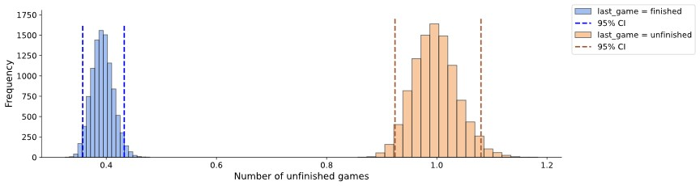
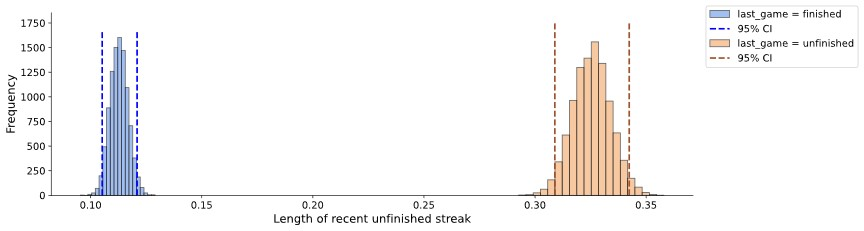
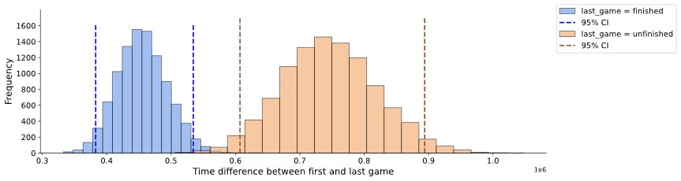
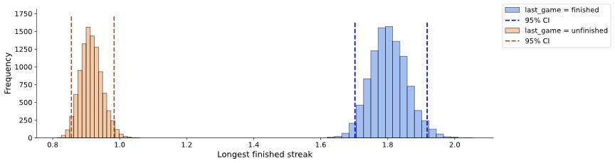
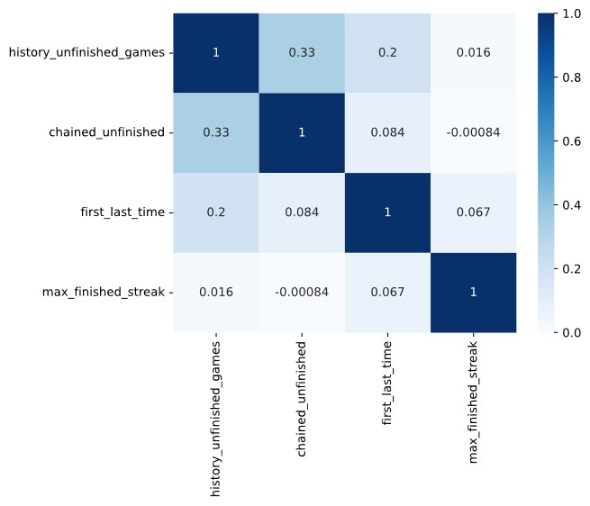
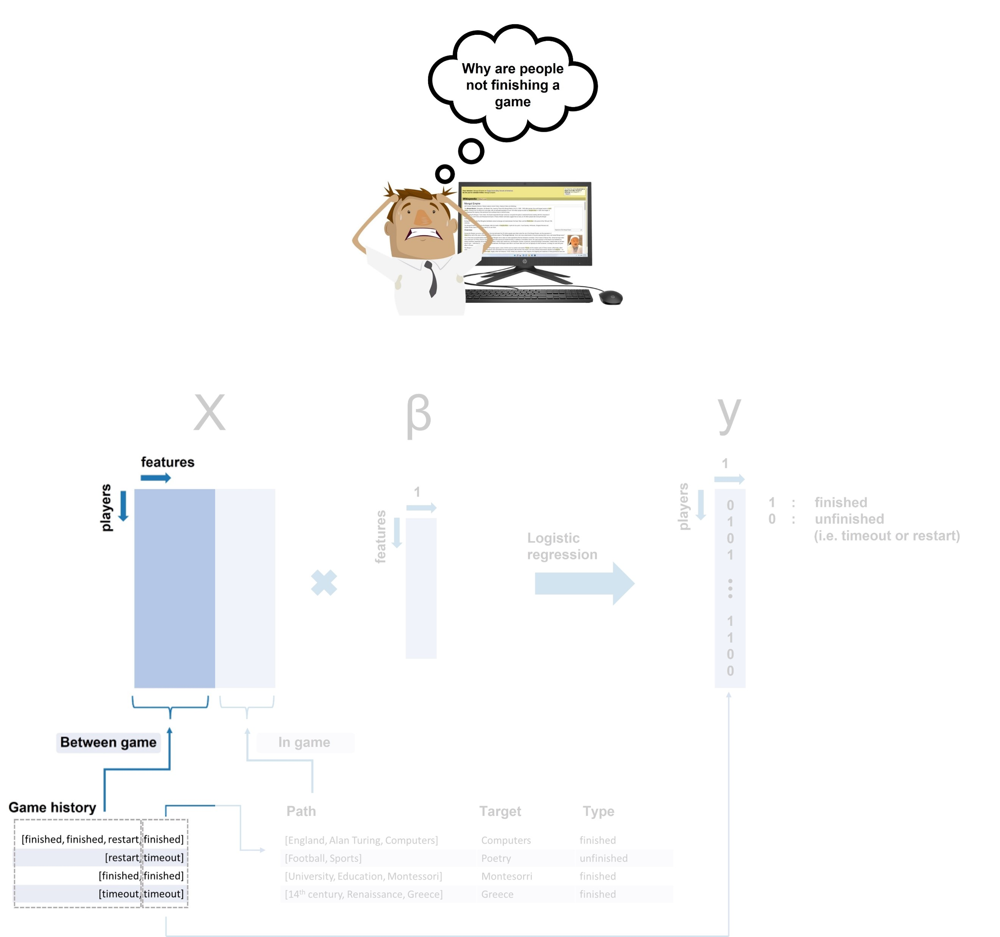

       <h2 style="color:white">1. Between game</h2>

    
        Here we will extract features based on the history of games of a player. The aim is to find features that can potentially seperate the classes <code class='python'>finished</code> and <code class='python'>unfinished (i.e. timeout or restart)</code>.
    

  

       <h2 style="color:white">1.1 Number of unfinished games.</h2>

    
        For the first feature we consider the number of unfinished games in total (excluding the last game) of the player. To examplify:  
        <ul>
        <li><code class='python'>[restart, finished, finished]</code>, number of unfinished games: <b>1</b></li>
        <li><code class='python'>[restart, finished, timeout]</code>, number of unfinished games: <b>1</b></li>
        <li><code class='python'>[timeout]</code>, number of unfinished games: <b>0</b></li>
        </ul>
        As we want to predict the class of the last game of a player, we only look in the past games of the players.  
        A bootstrap algorithm is performed to (visually) inspect wether this features can seperate both classesd. As observed <i><b>Figure 4</b></i> this is indeed the case. Hence we will use this feature in our model.
    

 

     

    <i ><b>Figure 4</b></i>

       <h2 style="color:white">1.2 Number succesive unfinished games before last game.</h2>

    
         For the second feature we want to consider the number of chained unfinished games up to the last game. We believe (intuitively) that this feature, in addition to the total number of unfinished games (see <b>1.1</b>), impacts the degree to which a player is likely to give up or not. To exemplify:  
         <ul>
         <li><code class='python'>[timeout restart timeout]</code>, recent unfinished streak: <b>2</b></li>
         <li><code class='python'>[timeout restart finished timeout]</code>, recent unfinished streak: <b>0</b></li>
         </ul> 
         Again, following a bootstrap analysis (<i><b>Figure 5</b></i>), we see that this features also significantly seperates both classes.
    

 

     

    <i ><b>Figure 5</b></i>

       <h2 style="color:white">1.3 Time difference between first and last game.</h2>

    
         For the third feature we focus on how long ago the first game of an individual players was with respect to their last. The motivation to investigate this feature is that a long time difference is a potential indicator predicting that a player is more likely to have an unfinished game as he feels the game has been "worn out".   
         The bootstrap anlaysis (<i><b>Figure 6</b></i>) suggests that this reasoning could be the case indeed.
    

 

     

    <i ><b>Figure 6</b></i>

       <h2 style="color:white">1.4 Longest win streak.</h2>

    
         Intuitively being on a long win streak, or having had a long win streak can be motivating for playing a game repeatedly despite having some unsuccesful games in between. Exactly for this reason we also want to consider the longest steak of finished games a player has had in the past.   
         According to our expected, people with their last game being succesful also have a significantly larger win streak in the past (<i><b>Figure 7</i></b>).
    

 

     

    <i ><b>Figure 7</b></i>

       <h2 style="color:white">1.5 Cross correlations.</h2>

    
         So far we have discussed 4 distinct features as potential predictors. However, we are not done yet. We would like to assess wether the different features are (independtly) meaningful. That is, we preferably want them to not correlate to much with each other. To assess this, we computed a covariance matix in the <i><b>Figure 8</i></b> below.
    

 

     

    <i ><b>Figure 8</b></i>

    
         Hence, we observe that the cross-correlations are generaly low, indicating that they all independently contribute meaningful information to our model. For that reason we take all features into account and add them to our model.   
         We have now finished the first part of building our model as depicted in <i><b>Figure 9</i></b> and the next step is to look at the <b>In game</b> features.
    

 

     

    <i ><b>Figure 8</b></i>

