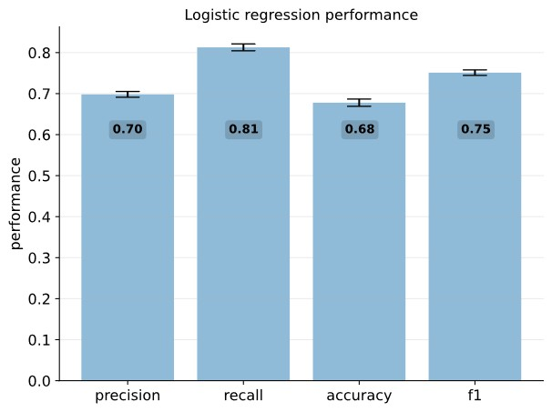
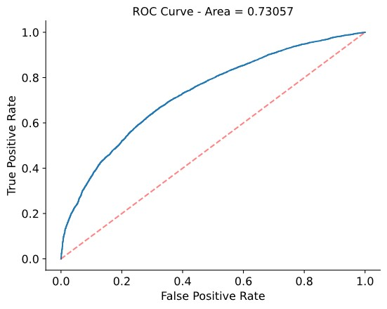
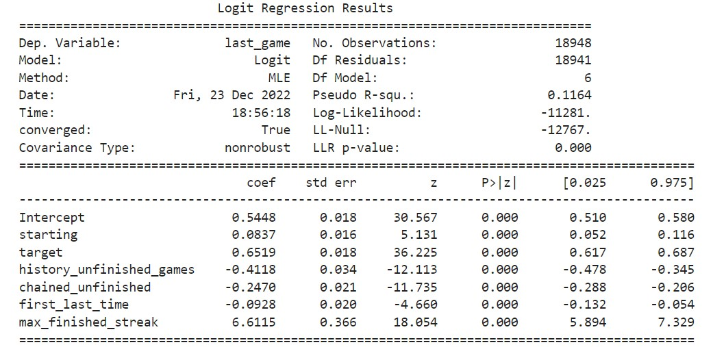

       <h2 style="color:white">3. Classification</h2>

    
        Here we perform a simple logistic regression to predict the classes finished or unfinished based on the features extracted in the between game and in game analysis. 
    

  

       <h2 style="color:white">3.1 Performance</h2>

    
        A 10-fold cross validation is performed to asses the performance of the logistic regression model along. More specifically we compute the following metric: precision, recall, accuracy and f-score. <i><b>Figure</b></i> Below displays the results.
    

 

     

    <i ><b>Figure 15</b></i>

    
        We can interpret these results as follows:  
        <ul>
        <li><b>precision</b> : The fraction (<b>0.70</b>) of a predicted finished games that are actually finished by the player.</li>
        <li><b>recall</b> : The fraction (<b>0.81</b>) actual finished games that are predicted as finished by the model.</li>
        <li><b>accuracy</b> : The total fraction (<b>0.68</b>) of correctly predicted classes</li>
        <li><b>f1</b> : The harmonic mean of precision and recall.</li>
        </ul>
        These results are dependent on the the decision threshold of 0.5. That is, we predict the game to be finished for values larger then 0.5. Similarly we predict unfinished games for values smaller than 0.5. In addition, we computed the ROC AUC curve (<i><b>Figure 16</b></i>) as this is independent on the choice of threshold (unlike accuracy, precision, recall and f1).
    

 

     

    <i ><b>Figure 16</b></i>

    
        We observe the AUC of 0.73 which is considered acceptable for a classifier <a href="https://www.jto.org/article/S1556-0864(15)30604-3/fulltext">[5]</a>
    

   

       <h2 style="color:white">3.2 Interpretation of the features</h2>

    
       A summary of the logistic regression is depicted in <i><b>Figure 17</b></i> below.
    

 

     

    <i ><b>Figure 17</b></i>

    
       For every predictor we find a significant p-value (<code class='python'>P>|z|</code>), rejecting the null hypothesis that the predictor has no effect on the dependent variable (the binary class finished=1 or unfinished=0). All features are standardized prior to the classification and the relative importance of each feature can be derived from the magnitude of the coefficient (<code class='python'>coeff</code>). The magnitude indicates the strength of the effect on the dependent variable and the sign (+/-) indicates the nature of the effect. Accordingly we can interpret for each variable the effect on the prediction:   
       <b>Positive predictors</b>
       <ul>
       <li><b>max_finished_streak</b>: is showing the largest (positive) coefficient in the logistic model and is therefore an important factor in predicting the correct class. This feature contains information about the longest path of finished games in a player's history before the final game. This suggests that having had a long streak motivates the player to achieve another finished attempt</li>
       <li><b>starting</b>: contains information on the likelihood of finishing a game based on the concept of the starting page.</li>
       <li><b>target</b>: contains information on the likelihood of finishing a game based on the concept of the target page. The magnitude is relatively higher than for starting. This suggests that the "diffuculty" of the concept has more impact when it concerns the target then the starting page. This is in accordance to our expectation as it is relatively easy to diverge from a difficult topic compared to converging to one.</li> 
       </ul>
       <b>Negative predictors</b>
       <ul>
       <li><b>history_unfinished_games</b>: is showing the largest negative coefficient in the logistic model. This suggets that a player with a lot of unfinished games in the history is therefore more likely to not finish a game.</li>
       <li><b>chained_unfinished</b>: contains information about how long the chain of unfinished games was before the last game. The longer the chain, the more it will contribute that the player will not finish the game.</li>
       <li><b>first_last_time</b>:  has the smallest coefficient of the logistic regression. It seems like there is not a big influence if a player played the first time a long time ago.</li>
       </ul>
       These results are in accordance with our preliminary analysis in the between game and in game sections.
    

