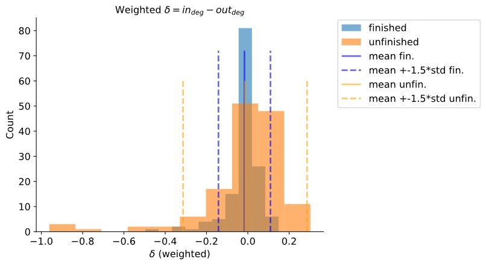
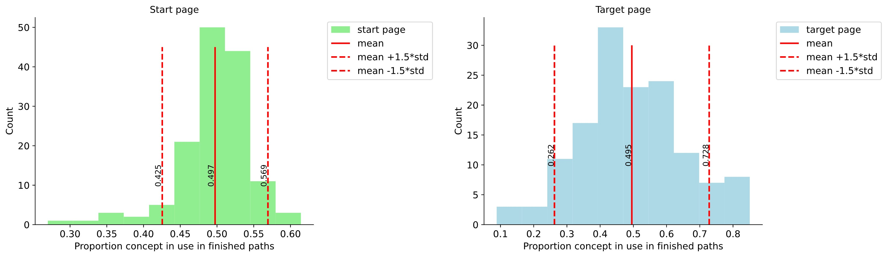

       <h2 style="color:white">2. In game</h2>

    
        After having made an analysis based on players history, we now focus on the analysis per game and try to understand what makes a player finish or not. We first focus on the Wikipedia page categories to see if players get stuck in certain ones, and if the starting or the target page has an impact on the success of the game. Then we focus on the paths and try to find out the relationship between the path the player took, the distance to the target and the result of the game, as well as the motivation to keep playing.
    

  

       <h2 style="color:white">2.1 Analysis on categories.</h2>

    
        We want to analyze where the player can get stuck during their games as this could potentially lead to an unfinished result. For each Wikipedia article in the players graph (i.e. that path taken during a game), we have its in and out degree and these two values are not always the same. In fact when we constructed  the graph we remove edges that went back to the previous pages visited. For example, suppose a player starts with page A and then goes to B. He/she might then see that it was not a good idea to go to B and uses the back button to return to A, after which the player moves go to C. At the end A has in/out degree of 0/2 whereas B has in/out degree 1/0. Therefore, analysising the difference between the degrees can give us insight on where player get stuck.   
        In fact when we compute <code class='python'>D = in_deg - out_degree</code>, we can have two cases:  
        <ul>
        <li><b><code class='python'>D</code> is big</b>: we came to this node (wikipedia page) but then returned to the previous one - the player thought that he/she was on the wrong way (node B in our example)</li>
        <li><b><code class='python'>D</code> is negative</b>: this means that we get back and forth from this node, not knowing how to escape - the player think he is at a key node but does not know how to go further (node A in our example)</li>
        </ul>
    

 

     

    <i ><b>Figure 10</b></i>

    
        We observe in <i><b>Figure 10</b></i> above that the <code class='python'>D</code> for nodes in finished paths are concentrated around 0, which means the go back button was not used much during these games, whereas for unfinished paths, the histogram is skewed wider.   
        Looking more specifically at unfinished paths, we see that we have both cases (<code class='python'>D</code> is large positively and negatively). In addition what is interesting is the following:   
        <ul>
            <li>Nodes with <code class='python'>D</code> large positively (Node B) are the nodes that are used more often in finished paths like <code class='python'>Politics, History, Chemistry</code> which means that maybe players that did not finish did not adopt the good strategy and should have continued in the paths using these topics.</li>
            <li>Nodes with <code class='python'>D</code> large negatively (Node A), the node players cannot escape, are the ones related to topics like <code class='python'>Literature, Theatre, Architecture</code> which are the node used less in finished than in unfinished. So we might conclude that the players should escape these node as soon as possible and used better concepts like  <code class='python'>Politics</code>.</li>
        </ul>
        However, with this analysis we should be careful with possible <i>cofounder</i> which could be that the topics of <code class='python'>Literature, Theatre, Architecture</code> are intrinsically harder and this is why people get stuck. Nonetheless it is still an interesting observatioo that has been made here.
    

  

       <h2 style="color:white">2.2 Comparing topics of starting and target pages</h2>

    
        We will now look at the topic distribution for both the starting and target pages (<i><b>Figure 11</b></i>).   
        <h3><b>Starting page</b></h3>
        First we see that the starting page histogram has a smaller variance then the target page histogram. This is not a surprise since we know that the starting phase of going to a hub is the easiest part. Moreover we cannot say that a starting page is easier but there are still some pages that seems harder to start with  <code class='python'>['Architecture', 'Theatre', 'Literature_types', 'General_Biology', 'Language_and_literature', 'Design_and_Technology', 'Air_and_Sea_transport', 'Conflict_and_Peace']</code>. In particular, starting with the topic <code class='python'>Architecture</code> lead to a probability of sucess of <b>0.26</b> which means that the game is finished once over 4 attempts.   
        <h3><b>Target page</b></h3>
        In the target page histogram, we can see a lot of variance and there are topics that seems to be easier or harder than others. We can see that topics with <code class='python'>Geography</code> or <code class='python'>Countries</code> are quiet easy. Topics as <code class='python'>European_Countries, USA_Presidents, European_Geography</code> are finished more than 4 times over 5 attemps. On the other side, topics more related to <code class='python'>Movies</code> or <code class='python'>Literature</code> are harder. For example, the topic <code class='python'>General_Literature</code> has a score of <b>0.08</b> which mean that a game is finished less than 1 times over 10 with this concept as target.
    

 

     

    <i ><b>Figure 11</b></i>

    
        In conclusion, some starting and target concepts has a big impact on the result of a game. We will use these two score for our logistic regression.
    

